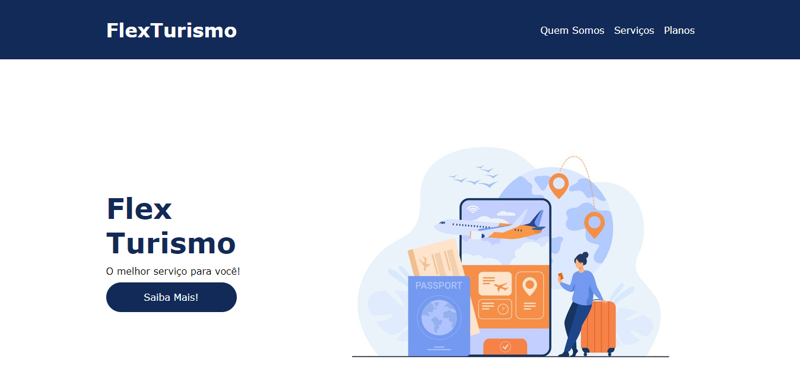

# Projeto Flexbox CSS

   

<h4 align="center">✔️ <strong>Projeto Concluído</strong> 🚀</h4>

## 📋 Sobre o Projeto

Este projeto foi desenvolvido durante as aulas de Flexbox CSS do Bootcamp Santander Fullstack Developer com o objetivo aplicar as propriedades flex-container e flex-items, utilizando as linguagens HTML e CSS para criar um modelo de web page de uma agência de turismo.

## 💻 Demonstração

Você pode acessar a [versão final do projeto](https://luccasmg.github.io/projeto-flexbox-css/).

## 📄 Links

[A Complete Guide to Flexbox - CSS-Tricks](https://css-tricks.com/snippets/css/a-guide-to-flexbox/)

[MDN Flexbox](https://developer.mozilla.org/pt-BR/docs/Learn/CSS/CSS_layout/Flexbox)

[Flexbox (Oragamid)](https://origamid.com/projetos/flexbox-guia-completo/)

[Flexbox (Alura)](https://www.alura.com.br/artigos/css-guia-do-flexbox?gclid=EAIaIQobChMIre6i7cLx-AIVa-hcCh0AFQhzEAAYASAAEgKM2fD_BwE)

## ✏️ Autor

| [ Luccas de Medeiros Gloria](https://github.com/luccasmg) |
| :---: |
